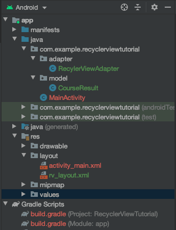
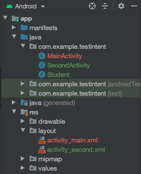
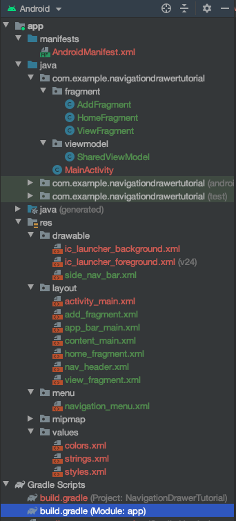

## ExAndroidDev
**Core Code for Each Part**

*This file includes all core code for each exercise.*

**Core Code**

Buttons and onClickListener
```java
	/* activity_main.xml */
	<EditText
	android:id="@+id/edit_message"
	android:layout_width="0dp"
	android:layout_height="wrap_content"
	android:layout_marginStart="16dp"
	android:layout_marginEnd="8dp"
	android:hint="@string/edit_message"
	app:layout_constraintEnd_toStartOf="@+id/reverseButton"
	app:layout_constraintStart_toStartOf="parent"
	tools:layout_editor_absoluteY="16dp" />

	<Button
		android:id="@+id/reverseButton"
		android:layout_width="wrap_content"
		android:layout_height="wrap_content"
		android:layout_marginEnd="20dp"
		android:text="@string/button_reverse"
		app:layout_constraintEnd_toStartOf="@+id/clearButton"
		tools:layout_editor_absoluteY="13dp" />

	<Button
		android:id="@+id/clearButton"
		android:layout_width="wrap_content"
		android:layout_height="wrap_content"
		android:layout_marginEnd="16dp"
		android:text="@string/button_clear"
		app:layout_constraintEnd_toEndOf="parent"
		tools:layout_editor_absoluteY="13dp" />
		
	/* strings.xml */
	<string name="app_name">Reverse Word</string>
	<string name="edit_message">Enter a word</string>
	<string name="button_reverse">Reverse</string>
	<string name="button_clear">Clear</string>
	
	/* MainActivity.java within onCreate(...) method */
	Button reverseButton = findViewById(R.id.reverseButton);
	Button clearButton = findViewById(R.id.clearButton);

	reverseButton.setOnClickListener(new View.OnClickListener() {
		public void onClick(View v) {
			EditText editText = findViewById(R.id.edit_message);
			String builder = new StringBuilder(editText.getText()).reverse().toString();
			editText.setText(builder);
		}
	});

	clearButton.setOnClickListener(new View.OnClickListener() {
		public void onClick(View v) {
			EditText editText = findViewById(R.id.edit_message);
			editText.setText("");
		}
	});
```

Spinner
```java
	/* strings.xml */
	<string name="app_name">SpinnerTutorial</string>
	<string-array name="course_array">
		<item>MIT</item>
		<item>MNS</item>
		<item>MDS</item>
		<item>MBIS</item>
		<item>BIT(Hons)</item>
	</string-array>
	
	/* activity_main.xml */
	<TextView
		android:id="@+id/textView"
		android:layout_width="wrap_content"
		android:layout_height="wrap_content"
		android:layout_marginStart="16dp"
		android:layout_marginTop="16dp"
		android:layout_marginEnd="16dp"
		android:text="Hello World!"
		app:layout_constraintEnd_toEndOf="parent"
		app:layout_constraintStart_toStartOf="parent"
		app:layout_constraintTop_toTopOf="parent" />

	<Button
		android:id="@+id/button"
		android:layout_width="wrap_content"
		android:layout_height="wrap_content"
		android:layout_marginStart="16dp"
		android:layout_marginTop="8dp"
		android:layout_marginEnd="16dp"
		android:text="Button"
		app:layout_constraintEnd_toEndOf="parent"
		app:layout_constraintStart_toStartOf="parent"
		app:layout_constraintTop_toBottomOf="@+id/courseSpinner" />

	<Spinner
		android:id="@+id/courseSpinner"
		android:layout_width="wrap_content"
		android:layout_height="wrap_content"
		android:layout_marginStart="16dp"
		android:layout_marginTop="8dp"
		android:layout_marginEnd="16dp"
		android:entries="@array/course_array"
		app:layout_constraintEnd_toEndOf="parent"
		app:layout_constraintStart_toStartOf="parent"
		app:layout_constraintTop_toBottomOf="@+id/textView" />

	<Button
		android:id="@+id/button2"
		android:layout_width="wrap_content"
		android:layout_height="wrap_content"
		android:layout_marginStart="16dp"
		android:layout_marginTop="32dp"
		android:layout_marginEnd="16dp"
		android:text="Add a New Movie"
		app:layout_constraintEnd_toEndOf="parent"
		app:layout_constraintStart_toStartOf="parent"
		app:layout_constraintTop_toBottomOf="@+id/spinner2" />

	<Spinner
		android:id="@+id/spinner2"
		android:layout_width="wrap_content"
		android:layout_height="wrap_content"
		android:layout_marginStart="16dp"
		android:layout_marginTop="16dp"
		android:layout_marginEnd="16dp"
		app:layout_constraintEnd_toEndOf="parent"
		app:layout_constraintStart_toStartOf="parent"
		app:layout_constraintTop_toBottomOf="@+id/editText" />

	<EditText
		android:id="@+id/editText"
		android:layout_width="wrap_content"
		android:layout_height="wrap_content"
		android:layout_marginStart="16dp"
		android:layout_marginTop="150dp"
		android:layout_marginEnd="16dp"
		android:ems="10"
		android:inputType="textPersonName"
		android:text="Input New Movie Name"
		app:layout_constraintEnd_toEndOf="parent"
		app:layout_constraintStart_toStartOf="parent"
		app:layout_constraintTop_toBottomOf="@+id/button" />
	
	/* MainActivity.java within onCreate(...) method */
	final TextView textView = findViewById(R.id.textView);
	Button button = findViewById(R.id.button);
	final Spinner courseSpinner = findViewById(R.id.courseSpinner);

	button.setOnClickListener(new View.OnClickListener() {
		@Override
		public void onClick(View v) {
			String selectedCourse = courseSpinner.getSelectedItem().toString();
			textView.setText(selectedCourse);
		}
	});

	// Dynamic data using ArrayAdapter
	List<String> list = new ArrayList<String>();
	list.add("Avengers");
	list.add("Lion King");
	list.add("John Wick");

	Button buttonAddMovie = findViewById(R.id.button2);
	final EditText editText = findViewById(R.id.editText);
	final Spinner movieList = findViewById(R.id.spinner2);

	final ArrayAdapter<String> spinnerAdapter = new ArrayAdapter<String>(this, android.R.layout.simple_spinner_item, list);
	movieList.setAdapter(spinnerAdapter);

	buttonAddMovie.setOnClickListener(new View.OnClickListener() {
		public void onClick(View v) {
			String newMovie = editText.getText().toString();
			spinnerAdapter.add(newMovie);
			spinnerAdapter.notifyDataSetChanged();
			movieList.setSelection(spinnerAdapter.getPosition(newMovie));
		}
	});

	movieList.setOnItemSelectedListener(new AdapterView.OnItemSelectedListener() {
		@Override
		public void onItemSelected(AdapterView<?> parent, View view, int position, long id) {
			String selectedMovie = parent.getItemAtPosition(position).toString();
			if (selectedMovie != null) {
				Toast.makeText(parent.getContext(), "Movie selected is " + selectedMovie, Toast.LENGTH_LONG).show();
			}
		}

		@Override
		public void onNothingSelected(AdapterView<?> parent) {

		}
	});
```

Recycler View



```java
	/* build.gradle(Module: app)
	dependencies {
		implementation fileTree(dir: 'libs', include: ['*.jar'])

		implementation 'androidx.recyclerview:recyclerview:1.1.0'

		implementation 'androidx.appcompat:appcompat:1.1.0'
		implementation 'androidx.constraintlayout:constraintlayout:1.1.3'
		testImplementation 'junit:junit:4.12'
		androidTestImplementation 'androidx.test.ext:junit:1.1.1'
		androidTestImplementation 'androidx.test.espresso:espresso-core:3.2.0'
	}

	/* activity_main.xml */
	<?xml version="1.0" encoding="utf-8"?>
	<LinearLayout xmlns:android="http://schemas.android.com/apk/res/android"
		android:layout_width="match_parent"
		android:layout_height="match_parent"
		android:orientation="vertical">

		<TextView
			android:layout_width="wrap_content"
			android:layout_height="wrap_content"
			android:id="@+id/tv_unit"
			android:text="Please enter unit code:" />

		<EditText
			android:layout_width="match_parent"
			android:layout_height="wrap_content"
			android:id="@+id/et_unit"
			android:inputType="text" />

		<TextView
			android:layout_width="wrap_content"
			android:layout_height="wrap_content"
			android:id="@+id/tv_mark"
			android:layout_marginTop="20dp"
			android:text="Please enter your result:" />

		<EditText
			android:layout_width="match_parent"
			android:layout_height="wrap_content"
			android:id="@+id/et_mark"
			android:inputType="number" />

		<Button
			android:layout_width="match_parent"
			android:layout_height="wrap_content"
			android:id="@+id/add_button"
			android:layout_gravity="end"
			android:text="Add " />

		<androidx.recyclerview.widget.RecyclerView
			android:id="@+id/recyclerView"
			android:layout_width="380dp"
			android:layout_height="400dp"
			android:layout_marginStart="8dp"
			android:layout_marginLeft="8dp"
			android:layout_marginEnd="8dp"
			android:layout_marginRight="8dp"
			android:layout_gravity="center"
			android:scrollbars="vertical" />

	</LinearLayout>
	
	/* create a new xml named rv_layout.xml in res folder */
	<?xml version="1.0" encoding="utf-8"?>
	<LinearLayout xmlns:android="http://schemas.android.com/apk/res/android"
		android:layout_width="match_parent"
		android:layout_height="wrap_content"
		android:orientation="horizontal">

		<TextView
			android:layout_width="0dp"
			android:layout_height="wrap_content"
			android:layout_weight="1"
			android:id="@+id/unit_name" />

		<TextView
			android:layout_width="0dp"
			android:layout_height="wrap_content"
			android:layout_weight="1"
			android:id="@+id/mark" />

		<ImageView
			android:layout_width="wrap_content"
			android:layout_height="wrap_content"
			android:id="@+id/iv_item_delete"
			android:layout_weight="1"
			android:padding="8dp"
			android:src="@android:drawable/ic_menu_close_clear_cancel"
			android:tint="@android:color/holo_red_dark" />

	</LinearLayout>

	/* create new packages and java classes: RecylerViewAdapter and CourseResult*/
	/* CourseResult.java */
	public class CourseResult {

		private String mUnit;
		private int mMark;

		public CourseResult(String unit, int mark) {
			mUnit = unit;
			mMark = mark;
		}

		public String getUnit() {
			return mUnit;
		}

		public int getMark() {
			return mMark;
		}

		public static List<CourseResult> createContactsList() {
			List<CourseResult> units = new ArrayList<>();
			units.add(new CourseResult("FIT5046",87));
			units.add(new CourseResult("FIT5152",77));
			return units;
		}

	}
	
	/* RecylerViewAdapter.java */
	public class RecylerViewAdapter extends RecyclerView.Adapter<RecylerViewAdapter.ViewHolder> {

		public class ViewHolder extends RecyclerView.ViewHolder {
			public TextView unitTextView;
			public TextView markTextView;
			public ImageView imageView;

			public ViewHolder(View itemView) {
				super(itemView);

				unitTextView = itemView.findViewById(R.id.unit_name);
				markTextView = itemView.findViewById(R.id.mark);
				imageView = itemView.findViewById(R.id.iv_item_delete);
			}
		}

		private List<CourseResult> courseResults;

		public RecylerViewAdapter(List<CourseResult> units) {
			courseResults = units;
		}

		public void addUnits(List<CourseResult> units) {
			courseResults = units;
			notifyDataSetChanged();
		}

		@NonNull
		@Override
		public ViewHolder onCreateViewHolder(@NonNull ViewGroup parent, int viewType) {
			Context context = parent.getContext();
			LayoutInflater inflater = LayoutInflater.from(context);

			View unitsView = inflater.inflate(R.layout.rv_layout, parent, false);
			ViewHolder viewHolder = new ViewHolder(unitsView);

			return viewHolder;
		}

		@Override
		public void onBindViewHolder(@NonNull ViewHolder holder, int position) {
			final CourseResult unit = courseResults.get(position);

			TextView tvUnit = holder.unitTextView;
			tvUnit.setText(unit.getUnit());
			TextView tvMark = holder.markTextView;
			tvMark.setText((Integer.toString(unit.getMark())));
			ImageView imageView = holder.imageView;
			imageView.setOnClickListener(new View.OnClickListener() {
				@Override
				public void onClick(View v) {
					courseResults.remove(unit);
					notifyDataSetChanged();
				}
			});
		}

		@Override
		public int getItemCount() {
			return courseResults.size();
		}
	}
	
	/* MainActivity.java */
	public class MainActivity extends AppCompatActivity {

		private RecyclerView recyclerView;
		private RecyclerView.Adapter mAdapter;
		private RecyclerView.LayoutManager layoutManager;
		private EditText etUnit, etMark;
		private Button button;
		private List<CourseResult> units;
		private RecylerViewAdapter adapter;

		@Override
		protected void onCreate(Bundle savedInstanceState) {
			super.onCreate(savedInstanceState);
			setContentView(R.layout.activity_main);

			recyclerView = findViewById(R.id.recyclerView);

			units = new ArrayList<CourseResult>();
			units = CourseResult.createContactsList();

			etUnit = findViewById(R.id.et_unit);
			etMark = findViewById(R.id.et_mark);
			button = findViewById(R.id.add_button);

			adapter = new RecylerViewAdapter(units);
			recyclerView.addItemDecoration(new DividerItemDecoration(this, LinearLayoutManager.VERTICAL));
			recyclerView.setAdapter(adapter);

			layoutManager = new LinearLayoutManager(this);
			recyclerView.setLayoutManager(layoutManager);

			button.setOnClickListener(new View.OnClickListener() {
				@Override
				public void onClick(View v) {
					String unit = etUnit.getText().toString().trim();
					String smark = etMark.getText().toString().trim();
					if (!unit.isEmpty() || !smark.isEmpty()) {
						int mark = 0;
						if (!smark.isEmpty()) {
							mark = new Integer(smark).intValue();
						}
						saveData(unit,mark);
					}
				}
			});


		}

		private void saveData(String unit, int mark) {
			CourseResult courseResult = new CourseResult(unit,mark);
			units.add(courseResult);
			adapter.addUnits(units);
		}
	}

```

Multiple Activities and Intent


```java
	/* Add new class named Student */
	public class Student implements Parcelable {

		private int id = 0;
		private String name = "";

		public Student(Parcel in) {
			this.id = in.readInt();
			this.name = in.readString();
		}

		public Student(int id, String name) {
			this.id = id;
			this.name = name;
		}

		public void writeToParcel(Parcel parcel, int flags) {
			parcel.writeInt(id);
			parcel.writeString(name);
		}

		public int describeContents() {
			return 0;
		}

		public static final Creator<Student> CREATOR = new Creator<Student>() {
			@Override
			public Student createFromParcel(Parcel source) {
				return new Student(source);
			}

			@Override
			public Student[] newArray(int size) {
				return new Student[size];
			}
		};
		
		// getter and setter
	}

	/* activity_main.xml */
	<LinearLayout xmlns:android="http://schemas.android.com/apk/res/android"
		android:layout_width="match_parent"
		android:layout_height="match_parent"
		android:orientation="vertical">

		<Button
			android:layout_width="match_parent"
			android:layout_height="wrap_content"
			android:id="@+id/startButton"
			android:text="Start Second Activity" />

		<TextView
			android:layout_width="wrap_content"
			android:layout_height="wrap_content"
			android:id="@+id/textView"
			android:text="We are in the first activity" />

	</LinearLayout>
	
	/* MainActivity.jave */
	@Override
	protected void onCreate(Bundle savedInstanceState) {
		super.onCreate(savedInstanceState);
		setContentView(R.layout.activity_main);

		Button button = findViewById(R.id.startButton);
		button.setOnClickListener(new View.OnClickListener() {
			@Override
			public void onClick(View v) {
				Intent intent = new Intent(MainActivity.this, SecondActivity.class);
				Bundle bundle = new Bundle();
				/*
				bundle.putString("name","John");
				bundle.putString("surname","Jiao");
				bundle.putInt("age",25);
				 */
				Student student = new Student(1,"John Jiao");
				bundle.putParcelable("student",student);
				intent.putExtras(bundle);
				startActivityForResult(intent,1);
			}
		});
	}

	@Override
	protected void onActivityResult(int requestCode, int resultCode, @Nullable Intent data) {
		if (requestCode == 1) {
			if (resultCode == RESULT_OK) {
				String message = data.getStringExtra("message");
				TextView textView = findViewById(R.id.textView);
				textView.setText(message);
			}
		}
	}
	
	/* Add new Empty Activity named SecondActivity */
	/* activity_second.xml */
	<LinearLayout xmlns:android="http://schemas.android.com/apk/res/android"
		android:layout_width="match_parent"
		android:layout_height="match_parent"
		android:orientation="vertical">

		<Button
			android:layout_width="match_parent"
			android:layout_height="wrap_content"
			android:id="@+id/button"
			android:text="Start First Activity" />

		<TextView
			android:layout_width="wrap_content"
			android:layout_height="wrap_content"
			android:id="@+id/textView"
			android:text="We are in the second activity" />

		<EditText
			android:layout_width="match_parent"
			android:layout_height="wrap_content"
			android:id="@+id/editText" />

		<Button
			android:layout_width="match_parent"
			android:layout_height="wrap_content"
			android:id="@+id/button2"
			android:text="Show Message" />

		<TextView
			android:layout_width="wrap_content"
			android:layout_height="wrap_content"
			android:id="@+id/messageText" />

	</LinearLayout>
	
	/* SecondActivity.jave */
	@Override
	protected void onCreate(Bundle savedInstanceState) {
		super.onCreate(savedInstanceState);
		setContentView(R.layout.activity_second);

		Button button = findViewById(R.id.button);
		Button messageButton = findViewById(R.id.button2);
		final TextView textView = findViewById(R.id.messageText);

		button.setOnClickListener(new View.OnClickListener() {
			@Override
			public void onClick(View v) {
				Intent returnIntent = getIntent();
				EditText editText = findViewById(R.id.editText);
				String message = editText.getText().toString();
				returnIntent.putExtra("message",message);

				setResult(RESULT_OK,returnIntent);
				finish();
			}
		});

		messageButton.setOnClickListener(new View.OnClickListener() {
			@Override
			public void onClick(View v) {
				Bundle bundle = getIntent().getExtras();
				/*
				String name = bundle.getString("name");
				String surname = bundle.getString("surname");
				Integer age = bundle.getInt("age");
				textView.setText(name+" " + surname + " " + age);
				 */
				Student student = bundle.getParcelable("student");
				String name = student.getName();
				int id = student.getId();
				textView.setText(id + " " + name);
			}
		});
	}


```

Navigation Drawer and Fragments



```java
	/* Add side_nav_bar.xml, and it is not a layout xml file */
	<shape android:shape="rectangle"
		xmlns:android="http://schemas.android.com/apk/res/android">

		<gradient android:type="linear"
			android:startColor="#4DB6AC"
			android:endColor="#00695C"
			android:centerColor="#009688"
			android:angle="135" />

	</shape>
	
	/* add nav_header.xml layout file, this file draw the app title or a logo in navigation */
	<LinearLayout xmlns:android="http://schemas.android.com/apk/res/android"
		android:layout_width="match_parent"
		android:layout_height="match_parent"
		android:background="@drawable/side_nav_bar">

		<ImageView
			android:layout_width="wrap_content"
			android:layout_height="wrap_content"
			android:layout_marginTop="15dp"
			android:layout_marginBottom="15dp"
			android:background="@mipmap/ic_launcher_round" />

	</LinearLayout>
	
	/* add dependency to build.gradle(Module:app) */
	implementation 'com.google.android.material:material:1.1.0'
	
	/* add new dependency navigation to activity_main.xml */
	<androidx.drawerlayout.widget.DrawerLayout
		xmlns:android="http://schemas.android.com/apk/res/android"
		xmlns:app="http://schemas.android.com/apk/res-auto"
		android:id="@+id/drawer_layout"
		android:layout_width="match_parent"
		android:layout_height="match_parent"
		android:fitsSystemWindows="true">

		<include
			layout="@layout/app_bar_main"
			android:layout_height="match_parent"
			android:layout_width="match_parent" />

		<com.google.android.material.navigation.NavigationView
			android:id="@+id/nv"
			android:layout_width="wrap_content"
			android:layout_height="match_parent"
			android:layout_gravity="start"
			app:headerLayout="@layout/nav_header"
			app:menu="@menu/navigation_menu" />

	</androidx.drawerlayout.widget.DrawerLayout>
	
	/* add new layout xml file app_bar_main.xml, it includes the toolbar */
	<androidx.coordinatorlayout.widget.CoordinatorLayout
		xmlns:android="http://schemas.android.com/apk/res/android"
		xmlns:app="http://schemas.android.com/apk/res-auto"
		xmlns:tools="http://schemas.android.com/tools"
		android:layout_height="match_parent"
		android:layout_width="match_parent"
		tools:context=".MainActivity">

		<com.google.android.material.appbar.AppBarLayout
			android:layout_width="match_parent"
			android:layout_height="wrap_content"
			android:theme="@style/AppTheme.AppBarOverlay">

			<androidx.appcompat.widget.Toolbar
				android:layout_width="match_parent"
				android:layout_height="?attr/actionBarSize"
				android:id="@+id/toolbar"
				android:background="?attr/colorPrimary"
				app:popupTheme="@style/AppTheme.PopupOverlay" />

		</com.google.android.material.appbar.AppBarLayout>

		<include layout="@layout/content_main" />

	</androidx.coordinatorlayout.widget.CoordinatorLayout>
	
	/* add content_main.xml layout file, includes the content_frame */
	<RelativeLayout xmlns:android="http://schemas.android.com/apk/res/android"
		android:layout_width="match_parent"
		android:layout_height="match_parent"
		xmlns:app="http://schemas.android.com/apk/res-auto"
		xmlns:tools="http://schemas.android.com/tools"
		app:layout_behavior="@string/appbar_scrolling_view_behavior"
		tools:showIn="@layout/app_bar_main">

		<FrameLayout
			android:layout_width="match_parent"
			android:layout_height="wrap_content"
			android:id="@+id/content_frame" />

	</RelativeLayout>
	
	/* Then add the menu folder and create the navigation_manu.xml file (right click on the menu folder and New -> Menu Resource File) */
	<menu xmlns:android="http://schemas.android.com/apk/res/android">

		<item
			android:id="@+id/addMessage"
			android:title="Add Message" />
		<item
			android:id="@+id/displayMessage"
			android:title="Display Message" />

	</menu>
	
	/* edit the styles.xml under values folder */
	<style name="AppTheme.NoActionBar">
		<item name="windowActionBar">false</item>
		<item name="windowNoTitle">true</item>
	</style>

	<style name="AppTheme.AppBarOverlay" parent="ThemeOverlay.AppCompat.Dark.ActionBar" />
	<style name="AppTheme.PopupOverlay" parent="ThemeOverlay.AppCompat.Light"/>
	
	/* add new style to manifest file AndroidManifest.xml */
	<activity android:name=".MainActivity"
			android:theme="@style/AppTheme.NoActionBar">
			
	/* and then edit strings.xml file under values folder */
	<resources>
		<string name="app_name">NavigationDrawerTutorial</string>
		<string name="Open">open</string>
		<string name="Close">close</string>
	</resources>

	
	
	

```

List View
```java

```

Room Persistent Library
```java

```

OKhttp
```java

```

HttpURLConnection
```java

```

Google Custom Search (with Google API)
```java

```

Google Maps
```java

```

Chart
```java

```

Image Downloader
```java

```